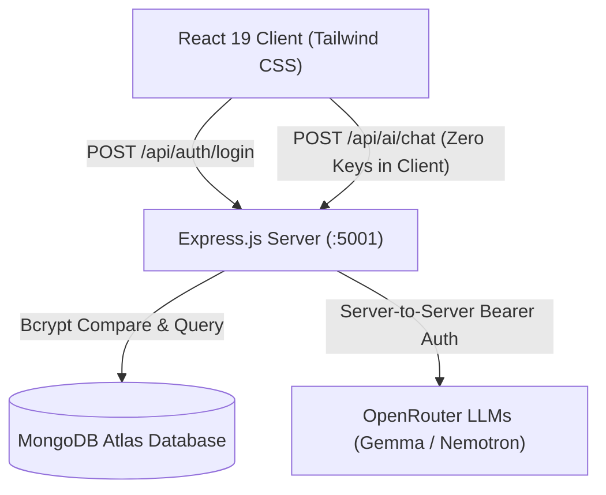

# EduID — Unified Student Identity & Academic Verification Platform

> **A secure, tamper-proof academic digital identity platform and student portfolio management system.**  
> Built with **React 19, Tailwind CSS, Express.js, MongoDB Atlas, and OpenRouter AI.**

🌐 **Live Demo (GitHub Pages)**: [https://shiva-prasad-ai.github.io/EduID/](https://shiva-prasad-ai.github.io/EduID/)  
📦 **Repository**: [https://github.com/Shiva-Prasad-ai/EduID](https://github.com/Shiva-Prasad-ai/EduID)

---

## 📌 Project Overview

EduID provides students, colleges, universities, and administrators with a standardized academic credential system. Each student receives a unique, collision-free identity string based on their state, admission year, and an unallocated 3-digit serial number.

### Key Highlights
* **Standardized EduID Format**: `EU-[State]-[Year]-[Serial]` (e.g. `EU-KA-2026-001` / `EUKA2026001`).
* **Zero-Secrets Frontend Security**: No database connection strings, OpenRouter AI keys, or passwords exist in client code, bundles, or DevTools Inspect.
* **Bcrypt-Encrypted Authentication**: Raw passwords are encrypted using `bcryptjs` (10 rounds) before persistence in MongoDB.
* **Jade AI Career Advisor**: Server-proxied career coaching powered by OpenRouter LLMs.
* **Resilient Dual-Mode Operation**: Fully connected to MongoDB Atlas locally or in cloud, with an automatic static demo preview mode for GitHub Pages.

---

## 🏛️ System Architecture



---

## 🆔 The EduID Specification Standard

The platform generates and validates identity codes using the following strict structural specification:

$$\mathbf{\text{EU}} - \mathbf{\text{[State]}} - \mathbf{\text{[Year]}} - \mathbf{\text{[3-Digit Unique Serial]}}$$

| Component | Length | Example | Meaning |
| :--- | :---: | :---: | :--- |
| **Prefix** | 2 Chars | `EU` | **Educational Universal** namespace identifier |
| **State Code** | 2 Chars | `KA` | 2-letter uppercase postal state code (`KA` = Karnataka) |
| **Academic Year** | 4 Digits | `2026` | Four-digit registration or admission cohort year |
| **Unique Serial** | 3 Digits | `001` | Non-occurring unique number between `001` and `999` verified in MongoDB |

* **Compact / DB Primary Key**: `EUKA2026001`
* **Human-Readable Display**: `EU-KA-2026-001`
* **Demo Account**:
  * **EduID**: `EUKA2026001` (or `EU-KA-2026-001`)
  * **Password**: `sample user`

---

## 💻 Main Code Snippets Explained

### 1. Unique Non-Occurring EduID Generator (`backend/utils/eduIdGenerator.js`)
Guarantees zero duplicate IDs by scanning existing sequence allocations in MongoDB and picking from remaining unallocated slots:
```javascript
export async function generateUniqueEduId(state = 'KA', year = 2026, randomize = true) {
  const cleanState = state.trim().toUpperCase().slice(0, 2);
  const cleanYear = Number(year) || 2026;

  // Retrieve already issued sequence numbers for state + year
  const existingUsers = await User.find(
    { state: cleanState, year: cleanYear },
    { sequenceNumber: 1 }
  ).lean();

  const usedNumbers = new Set(existingUsers.map(u => u.sequenceNumber));
  const availableNumbers = [];
  for (let i = 1; i <= 999; i++) {
    if (!usedNumbers.has(i)) availableNumbers.push(i);
  }

  const selectedNumber = randomize
    ? availableNumbers[Math.floor(Math.random() * availableNumbers.length)]
    : availableNumbers[0];

  const paddedNum = String(selectedNumber).padStart(3, '0');
  return {
    eduId: `EU${cleanState}${cleanYear}${paddedNum}`,
    formattedEduId: `EU-${cleanState}-${cleanYear}-${paddedNum}`,
    sequenceNumber: selectedNumber
  };
}
```

---

### 2. Secure Backend Authentication (`backend/routes/auth.js`)
Normalizes inputs, verifies with salted bcrypt hashes, and strips all database credentials and hashes before responding:
```javascript
router.post('/login', async (req, res) => {
  const { eduId, password } = req.body;
  const compactInput = eduId.trim().replace(/[^a-zA-Z0-9]/g, '').toUpperCase();

  const user = await User.findOne({
    $or: [{ eduId: compactInput }, { formattedEduId: eduId.trim() }]
  });

  if (!user || !(await bcrypt.compare(password, user.password))) {
    return res.status(401).json({ success: false, message: 'Invalid credentials.' });
  }

  // Passwords and MongoDB internals are NEVER exposed
  res.status(200).json({
    success: true,
    user: {
      eduId: user.eduId,
      formattedEduId: user.formattedEduId,
      name: user.name,
      role: user.role,
      department: user.department,
      institution: user.institution
    }
  });
});
```

---

### 3. Server-Side AI Chat Proxy (`backend/routes/ai.js`)
Prevents OpenRouter API keys from being leaked in client-side bundles or network inspect tabs:
```javascript
router.post('/chat', async (req, res) => {
  const { messages } = req.body;
  const attempts = [
    { key: process.env.GEMMA_API_KEY, model: 'google/gemma-3-27b-it' },
    { key: process.env.NEMOTRON_API_KEY, model: 'openrouter/auto' }
  ].filter(a => Boolean(a.key));

  for (const attempt of attempts) {
    const response = await fetch('https://openrouter.ai/api/v1/chat/completions', {
      method: 'POST',
      headers: {
        'Authorization': `Bearer ${attempt.key}`,
        'Content-Type': 'application/json'
      },
      body: JSON.stringify({ model: attempt.model, messages, max_tokens: 400 })
    });
    if (response.ok) {
      const data = await response.json();
      return res.status(200).json({ success: true, content: data.choices[0].message.content });
    }
  }
  res.status(502).json({ error: 'AI unavailable' });
});
```

---

### 4. Windows MongoDB DNS Fallback (`backend/server.js`)
Forces Node.js to use Google DNS to prevent Windows network `ECONNREFUSED` SRV lookup errors on MongoDB Atlas:
```javascript
import dns from 'dns';
dns.setServers(['8.8.8.8', '8.8.4.4']);
```

---

## 🔒 Security Hardening Summary

| Protection | Implementation Details |
| :--- | :--- |
| **API Keys Hidden** | `GEMMA_API_KEY` & `NEMOTRON_API_KEY` moved strictly to `backend/.env`. |
| **Database Keys Protected** | `.gitignore` configured to ignore `.env`, `backend/.env`, and all `.env.*` files. |
| **Zero Client Plaintext Passwords** | Hashed with `bcryptjs` (10 rounds). |
| **Mixed Content & Deployment Resilient** | `src/config/api.js` automatically routes to active environment. |

---

## 🚀 Running the Project Locally

### 1. Prerequisites
* Node.js (v18+ recommended)
* MongoDB Atlas connection string (placed in `backend/.env`)

### 2. Environment Configuration
Create `backend/.env` (see `backend/.env.example`):
```env
PORT=5001
MONGODB_URI=your_mongodb_connection_string
GEMMA_API_KEY=your_openrouter_key
NEMOTRON_API_KEY=your_openrouter_key
```

### 3. Launch
Use `start.bat` or run:
```bash
# Terminal 1: Backend Server (Port 5001)
cd backend
npm run dev

# Terminal 2: Frontend (Port 5173)
npm run dev
```

---

## 🚢 Deploying to GitHub Pages

To update the live GitHub Pages site:
```bash
npm run deploy
```
This builds the production bundle and pushes directly to the `gh-pages` branch.
